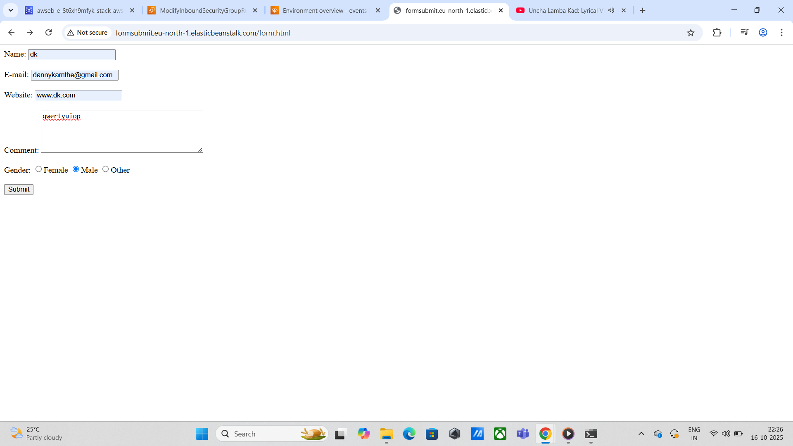

### 📘 Deploying AWS Elastic Beanstalk with RDS Access from EC2
### 🛠️ Tools & Technologies

AWS Elastic Beanstalk

Amazon RDS (MySQL/PostgreSQL)

Amazon EC2

VPC, Subnets, Security Groups

Optional: AWS Systems Manager, CloudWatch

---
## 🏗 Architecture Overview

```plaintext
+---------------------+        +----------------------+
| Elastic Beanstalk    | <-->  | Amazon RDS           |
| (Web Application)   |        | (MySQL/PostgreSQL)  |
+---------------------+        +----------------------+
           |
           | (Within same VPC/Subnet)
           ↓
+---------------------+
| EC2 Instance        |
| (Database Client)   |
+---------------------+

```

### ✅ Step-by-Step Instructions
### Step 1: Set Up Elastic Beanstalk

Create a new EB application (Node.js, Python Flask, PHP).

While configuring the environment:

Enable creation of an RDS instance (MySQL/PostgreSQL).

Make sure RDS is in the same VPC as EB.

 ### Step 2: Configure RDS

Get the RDS endpoint and credentials from the EB console.

Adjust RDS security group rules:

Open DB port: 3306 (MySQL) or 5432 (PostgreSQL)

Allow inbound traffic from EB SG and EC2 SG.

Set Public Accessibility only if external access is required.

 ### Step 3: EC2 Instance Setup

Launch an EC2 instance in the same VPC.

#### SSH into it:
```bash
ssh -i your-key.pem ec2-user@<EC2-Public-IP>
```

### Install database client:

#### MySQL
```bash
sudo yum install -y mysql
```

#### PostgreSQL
```bash
sudo yum install -y postgresql
```

### Step 4: Connect to RDS from EC2
#### MySQL
```bash
mysql -h <RDS-endpoint> -u <db-user> -p
```

#### PostgreSQL
```bash
psql -h <RDS-endpoint> -U <db-user> -d <db-name>
 ```

### Test by creating a database and listing:
```bash
CREATE DATABASE test_db;
SHOW DATABASES;
```
## Screenshots

 🖼️ Security Group of RDS
 <p align="center">  </p>


🖼️ Security Group of Beanstalk
 <p align="center">  </p>


🖼️ Security Group of Beanstalk Ec2
 <p align="center">  </p>
 

🖼️ Record Added Successfully in RDS
 <p align="center">  </p>


🖼️ Form.html
 <p align="center">  </p>


 🖼️ Submission Success
 <p align="center">  </p>

#### 🔒 Optional Enhancements
### 1. Secure RDS Credentials
Using AWS Systems Manager Parameter Store

Store credentials:
```bash
/project/db-username → SecureString → <db-username>

/project/db-password → SecureString → <db-password>

Retrieve credentials on EC2
sudo yum install -y aws-cli

aws ssm get-parameter --name "/project/db-username" --with-decryption --query "Parameter.Value" --output text
aws ssm get-parameter --name "/project/db-password" --with-decryption --query "Parameter.Value" --output text

```
### 2. DB Test Script
```bash
#!/bin/bash

DB_HOST="<RDS-endpoint>"
DB_USER=$(aws ssm get-parameter --name "/project/db-username" --with-decryption --query "Parameter.Value" --output text)
DB_PASS=$(aws ssm get-parameter --name "/project/db-password" --with-decryption --query "Parameter.Value" --output text)

mysql -h $DB_HOST -u $DB_USER -p$DB_PASS -e "CREATE DATABASE IF NOT EXISTS test_db;"
mysql -h $DB_HOST -u $DB_USER -p$DB_PASS -e "SHOW DATABASES;"


Make it executable and run:

chmod +x test_db.sh
./test_db.sh
```

### 3. Monitor RDS Using CloudWatch

Create CloudWatch alarms for CPU, Storage, and Connections.

Configure notifications (e.g., email via SNS).

⚠️ Security Recommendations

Avoid enabling Public Accessibility unless necessary.

Limit RDS inbound rules to EB and EC2 security groups only.

Do not hardcode credentials; use Parameter Store or Secrets Manager.

Monitor RDS with CloudWatch regularly.

### 👨‍💻 Author

Dhananjay Kamthe
📧 dhananjaykamthe2@gmail.com
